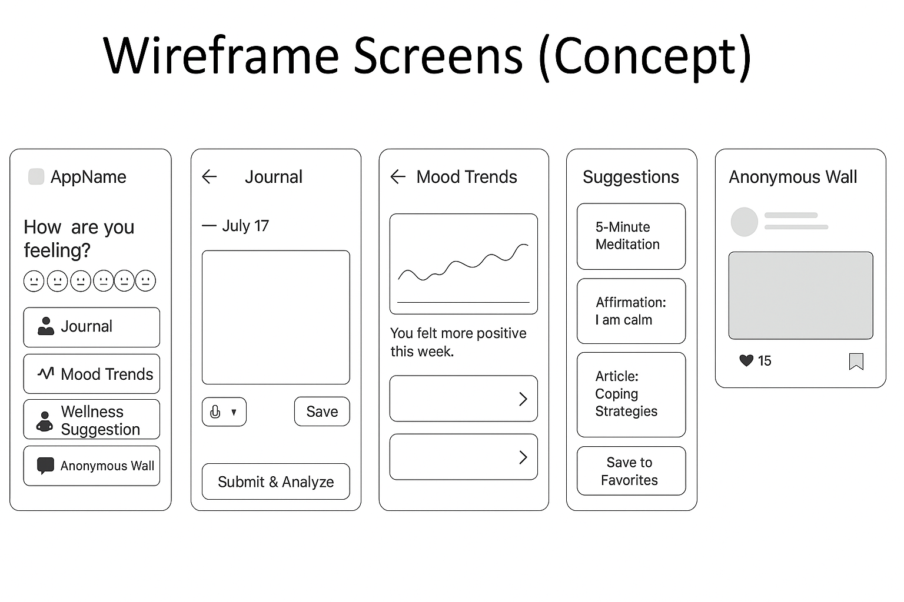

# 🧠 MindMate – AI-Powered Mental Wellness Platform

> *A privacy-first mental wellness platform that helps users understand their emotional well-being through AI-powered journaling, sentiment analysis, mood tracking, and personalized wellness recommendations.*


> ⚠️ **Disclaimer:** MindMate is a wellness companion, not a substitute for professional mental healthcare. If you're in crisis, please reach out to a licensed professional or a local emergency/crisis helpline.

---

# 📖 Overview

Mental health challenges often go unnoticed because people lack a private and accessible way to understand their emotions.

**MindMate** provides a secure digital journal where users can record their thoughts, monitor emotional trends through AI-powered sentiment analysis, and receive personalized wellness recommendations.

The platform also includes an anonymous community space where users can safely share experiences while protecting their identity.

Unlike traditional journaling apps, MindMate transforms raw journal entries into meaningful emotional insights using Natural Language Processing (NLP).

---

# ✨ Features

### 🔐 Authentication

* JWT Authentication with Refresh-Token Rotation
* Secure Password Hashing (bcrypt)
* Email Registration
* Login & Logout
* Protected Routes

---

### 📔 Smart Journal

* Daily Journal Entries (encrypted at rest)
* Rich Text Support
* Voice-to-Text (Planned)
* Edit/Delete Journals
* Search Previous Entries

---

### 😊 Mood Tracking

Track your emotional state every day.

Supported moods include:

* 😀 Happy
* 😌 Calm
* 🤩 Excited
* 😐 Neutral
* 😢 Sad
* 😰 Anxious
* 😡 Angry
* 😞 Stressed

---

### 🤖 AI Sentiment Analysis

Each journal entry is analyzed asynchronously using a fine-tuned NLP model, so the app stays fast and responsive regardless of inference time.

The system identifies:

* Positive
* Neutral
* Negative

Future versions will classify:

* Joy
* Anxiety
* Fear
* Anger
* Sadness
* Surprise

---

### 📊 Mood Analytics Dashboard

Visualize your emotional journey with:

* Daily Mood Timeline
* Weekly Reports
* Monthly Reports
* Yearly Insights
* Emotion Heatmaps
* Mood Distribution Charts

---

### 🧘 Wellness Recommendations

Based on your emotional trends, MindMate recommends:

* Guided Meditation
* Deep Breathing Exercises
* Positive Affirmations
* Wellness Articles
* Relaxing Music
* Mindfulness Exercises

---

### 🌍 Anonymous Community

A safe space where users can:

* Share thoughts anonymously
* Like Posts
* Comment
* Report Abuse
* Support Others

No personal identity is displayed publicly. Posts are passed through an automated moderation layer that flags high-risk content for human review while keeping the author anonymous.

---

# 🏗 System Architecture

```
                 User
                   │
        React / React Native
                   │
             REST API
                   │
          Node.js + Express
      ┌────────────┼────────────┐
      │            │            │
 Authentication  Journal API  Community API
      │            │            │
      └────────────┼────────────┘
                   │
             MongoDB Atlas
                   │
          Message Queue (Async)
                   │
       AI Sentiment Analysis Service
       (Fine-tuned HuggingFace model)
                   │
         Recommendation Engine
```

Journal writes are committed immediately. Sentiment analysis runs off the request path via a message queue, so AI inference never blocks the user-facing API.

---

# 🛠 Tech Stack

## Frontend

* React.js
* React Native
* Tailwind CSS
* React Router

## Backend

* Node.js
* Express.js

## Database

* MongoDB Atlas

## Authentication

* JWT (with refresh-token rotation)
* bcrypt

## Artificial Intelligence

* Hugging Face Transformers (fine-tuned sentiment model)
* OpenAI API *(optional fallback)*

## Charts

* Chart.js
* Recharts

## DevOps & Cloud

* Docker (containerized services)
* AWS (ECS/EKS)
* GitHub Actions (CI/CD)

## Version Control

* Git
* GitHub

---

# 📁 Project Structure

```
MindMate/
│── client/
│   ├── src/
│   ├── components/
│   ├── pages/
│   ├── hooks/
│   ├── services/
│   └── assets/
│
│── server/
│   ├── config/
│   ├── controllers/
│   ├── middleware/
│   ├── models/
│   ├── routes/
│   ├── services/
│   ├── utils/
│   └── app.js
│
│── ai/
│   ├── sentiment.py
│   ├── recommendation.py
│   └── models/
│
│── .github/
│   └── workflows/        # CI/CD pipelines
│
│── docs/
│── README.md
```

---

# 🚀 Installation

Clone the repository

```bash
git clone https://github.com/tkarman-singh/mindmate.git
```

Navigate into the project

```bash
cd mindmate
```

Install frontend dependencies

```bash
cd client
npm install
```

Install backend dependencies

```bash
cd ../server
npm install
```

Create a `.env` file

```env
PORT=5000
MONGODB_URI=your_mongodb_connection
JWT_SECRET=your_secret_key
JWT_REFRESH_SECRET=your_refresh_secret
OPENAI_API_KEY=your_api_key
```

Run the backend

```bash
npm run dev
```

Run the frontend

```bash
npm start
```

---

# 🔌 REST API

## Authentication

```
POST   /api/auth/register
POST   /api/auth/login
POST   /api/auth/logout
```

## Journal

```
GET    /api/journal
POST   /api/journal
PUT    /api/journal/:id
DELETE /api/journal/:id
```

## Mood

```
POST /api/mood
GET  /api/mood/history
```

## Recommendations

```
GET /api/recommendations
```

## Community

```
GET  /api/community
POST /api/community
POST /api/community/:id/comment
POST /api/community/:id/like
```

---

# 🔒 Security

* JWT Authentication with Refresh-Token Rotation
* Password Hashing (bcrypt)
* AES-256 Field-Level Encryption for Journal Entries
* HTTPS
* Input Validation
* Rate Limiting
* XSS Protection
* NoSQL Injection Protection
* Secure HTTP Headers
* Environment Variables

---

# 🎨 Wireframes (Concept)

Early concept wireframes for the core user flows — mood check-in, journaling, mood trends, AI suggestions, and the anonymous community wall.



---

# 📸 Screenshots

## Home

> *(Coming Soon)*

## Journal

> *(Coming Soon)*

## Mood Dashboard

> *(Coming Soon)*

## Anonymous Community

> *(Coming Soon)*

---

# 🛣 Roadmap

* [x] Project Planning
* [ ] Authentication
* [ ] Journal Module
* [ ] Mood Tracking
* [ ] Sentiment Analysis
* [ ] Dashboard
* [ ] AI Recommendation Engine
* [ ] Community Module
* [ ] Push Notifications
* [ ] Deployment

---

# 💡 Future Enhancements

* AI Chat Companion
* Voice Emotion Recognition
* Wearable Device Integration
* Offline Journaling
* Calendar View
* Therapist Dashboard
* Emergency SOS Detection
* Personalized Habit Tracker
* Multi-language Support

---

# 🤝 Contributing

Contributions are welcome.

If you'd like to improve MindMate:

1. Fork the repository.
2. Create a feature branch.
3. Commit your changes.
4. Open a Pull Request.

---

# 📄 License

This project is licensed under the MIT License.

---

# 👨‍💻 Author

**Karman Singh**

* Computer Science Undergraduate
* Passionate about Artificial Intelligence, Full-Stack Development, and Human-Centered Software Engineering.

If you found this project interesting, consider giving it a ⭐ on GitHub!